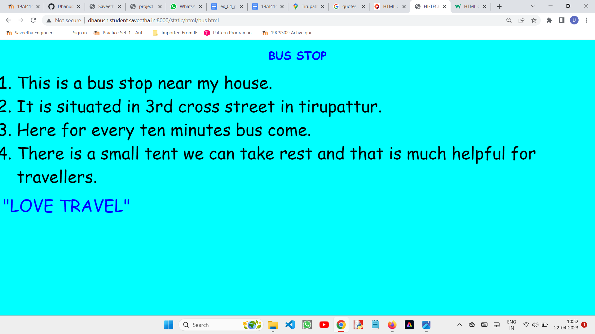
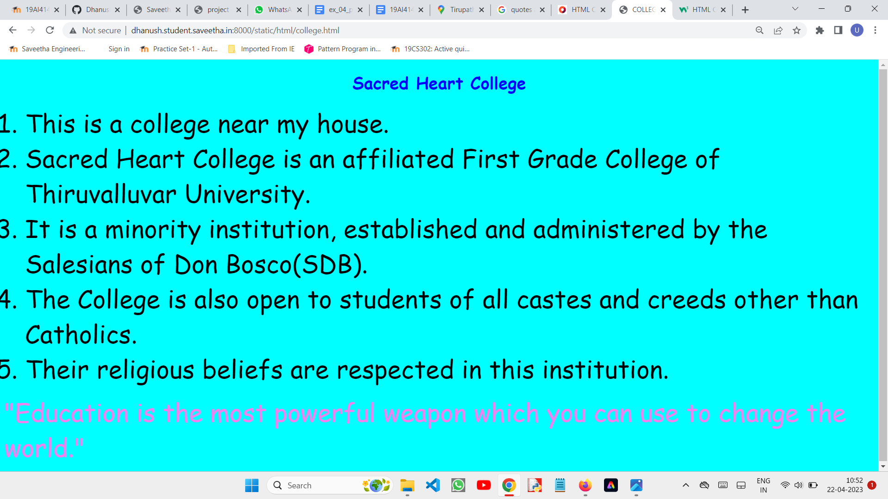
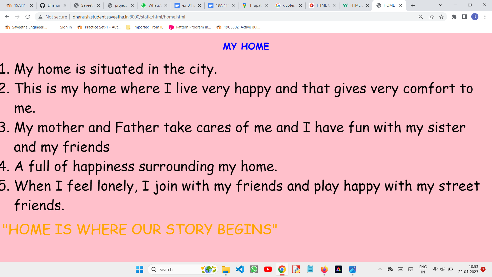
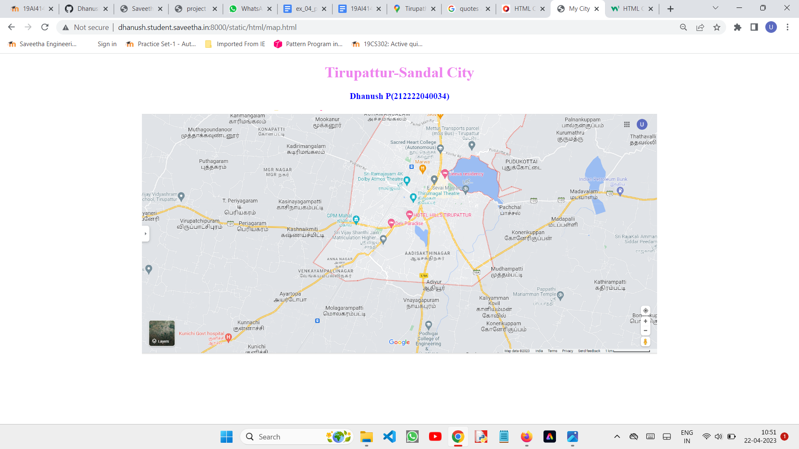
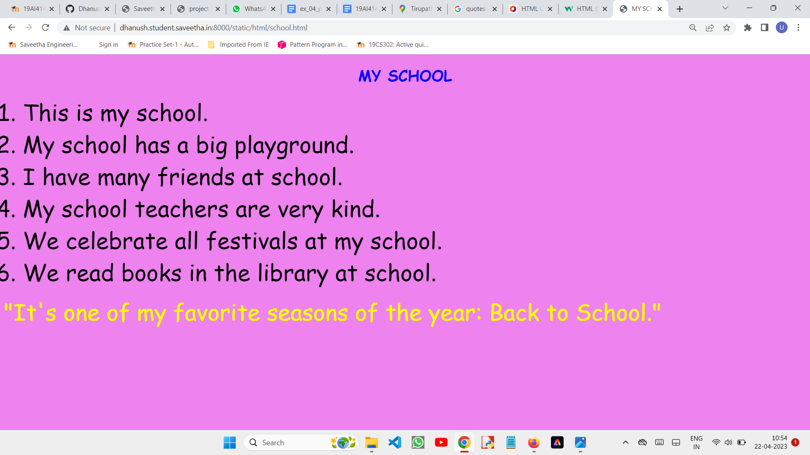

# Places Around Me
## AIM:
To develop a website to display details about the places around my house.

## Design Steps:

### Step 1:
clone the github repository into Theia IDE.
### Step 2:
create a new Django project
### step 3:
write the needed HTML code.
### step 4:
Run the Django server and execute the HTML files.
## Code:
```
map.html

<!DOCTYPE html>
<html lang="en">
    <head>
        <title>My City</title>
    </head>
    <body>
        <h1 align="center">
            <font color="violet">Tirupattur-Sandal City</b></font>
        </h1>
        <h3 align="center">
            <font color="blue">Dhanush P(212222040034)</b></font>
        </h3>
        <center>
            
            <map name="Sandal City">
            <area shape="circle"coords="190,50,20"href="/static/html/bus.html"title="Bus Stand">
            <area shape="rectangle"coords="230,30,260,60"href="/static/html/college.html"title="Sacred Heart College">
            <area shape="circle"coords="400,350,50"href="/static/html/home.html"title="My Home">
            <area shape="rectangle"coords="400,200,75"href="/static/html/hotel.html"title="Hotel Hills">
            <area shape="circle"coords="490,150,870,320"href="/static/html/map.html"title="My Map">
            <area shape="rectangle"coords="400,200,75"href="/static/html/school.html"title="My School">
            </map>
        </center>
    </body>
</bg>
</html>

bus.html

<!DOCTYPE html>
<html lang="en">
<head>
    <title>
        HI-TECH BUS STOP
    </title>
</head>
<body bgcolor="cyan" >
<h1 align="center">
    <font color="blue" face="cursive">
        BUS STOP
    </font>
</h1>
<p align="center">
    <font color="black" face="Comic Sans MS" size="24">
        <OL  TYPE="1" START="1">
            <LI> This is a bus stop near my house.<br></LI> 
            <LI>It is situated in 3rd cross street in tirupattur.<br></LI>   
            <LI>Here for every ten minutes bus come.<br></LI>
            <LI>There is a small tent we can take rest and that is much helpful for travellers.<br></LI>
        </OL>
    </font>
    <font color ="blue" face = "cursive" size="16" > 
    "LOVE TRAVEL"
    </font>
</p>
</body>
</html>
theater.html
<!DOCTYPE html>
<html lang="en">
<head>
    <title>
        THEATER
    </title>
</head>
<body bgcolor="pink">
<h1 align="center">
    <font color="blue" face="cursive">
        THIRUMAGAL THEATER
    </font>
</h1>
<p align="center">
    <font color="black" face="Comic Sans MS" size="24">
        <OL  TYPE="1" START="1">
            <LI>This Thirumali Theater.<br></LI> 
            <LI>We are going to theater every week end and fun with friends.<br></LI>   
            <LI>This theater is very neat and fully furnish<br></LI>
            <LI>This theater is very expensive.<br></LI>
            <LI>The theater have 3d glass vision.<br></LI>
        </OL>
    </font>
    <font color ="orange" face = "cursive" size="16" > 
    "Entertainment begins everywhere"
    </font>
</p>
</body>
</html>


school.html

<!DOCTYPE html>
<html lang="en">
<head>
    <title>
        MY SCHOOL
    </title>
</head>
<body bgcolor="violet">
<h1 align="center">
    <font color="blue" face="cursive">
        MY SCHOOL
    </font>
</h1>
<p align="center">
    <font color="black" face="Comic Sans MS" size="24">
        <OL  TYPE="1" START="1">
            <LI> This is my school.<br></LI> 
            <LI>My school has a big playground.<br></LI>   
            <LI>I have many friends at school.<br></LI>
            <LI>My school teachers are very kind.<br></LI>
            <LI>We celebrate all festivals at my school.<br></LI>
            <LI>We read books in the library at school.<br></LI>
        </OL>
    </font>
    <font color ="yellow" face = "cursive" size="16" > 
    "It's one of my favorite seasons of the year: Back to School."
    </font>
</p>
</body>
</html>

college.html

<!DOCTYPE html>
<html lang="en">
<head>
    <title>
        COLLEGE
    </title>
</head>
<body bgcolor="cyan">
<h1 align="center">
    <font color="blue" face="cursive">
        Sacred Heart College
    </font>
</h1>
<p align="center">
    <font color="black" face="Comic Sans MS" size="24">
        <OL  TYPE="1" START="1">
            <LI>This is a college near my house.<br></LI> 
            <LI>Sacred Heart College is an affiliated First Grade College of Thiruvalluvar University.<br></LI>   
            <LI>It is a minority institution, established and administered by the Salesians of Don Bosco(SDB).<br></LI>
            <LI>The College is also open to students of all castes and creeds other than Catholics.<br></LI>
            <LI> Their religious beliefs are respected in this institution.<br></LI>
        </OL>
    </font>
    <font color ="violet" face = "cursive" size="16" > 
    "Education is the most powerful weapon which you can use to change the world."
    </font>
</p>
</body>
</html>

hotrl.html
<!DOCTYPE html>
<html>
<head>
    <title>
        HOTEL
    </title>
</head>
<body bgcolor="yellow">
<h1 align="center">
    <font color="blue" face="cursive">
        HOTEL HILLS
    </font>
</h1>
<p align="center">
    <font color="black" face="Comic Sans MS" size="24">
        <OL  TYPE="1" START="1">
            <LI> Hotel name is Hotel Hills.<br></LI> 
            <LI>This is the biggest hotel near my.<br></LI>   
            <LI>During weak end me and my family take a delicious food in this hotel.<br></LI>
            <LI>Hotel is very clean and neat.<br></LI>
            <LI>The food is tasty and delicious.<br></LI>
        </OL>
    </font>
    <font color ="pink" face = "cursive" size="16" > 
    "FOOD IS VERY IMPORTANT."
    </font>
</p>
</body>
</html>
```


## Output:











## HTML Validator


## Result:
The program for implementing image map is executed successfully
